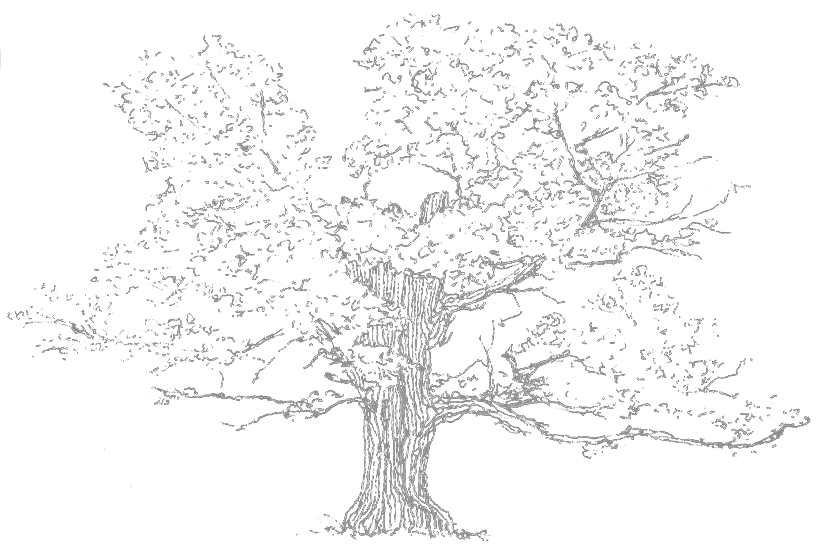

## Hola!
Me llamo Nicolás Donoso, soy programador con enfoque en el desarrollo Backend. Mi interés principal es estar siempre aprendiendo habilidades nuevas y de distintas áreas del conocimiento. 
Tengo una licenciatura en Artes plásticas, con especialidad en dibujo y pintura al óleo. También tengo estudios de matemáticas, piano y teoría musical. Me he dedicado a enseñar estas disciplinas y a tomarlas como recurso para aprender y crear usando la programación.

  <!--  -->

## Redes

 [🌱](https://www.instagram.com/nicosodonoso/) 
 [🌱](https://www.instagram.com/nicosodonoso/) 

## Herramientas

    

    

<!--
**muinicomuiser/muinicomuiser** is a ✨ _special_ ✨ repository because its `README.md` (this file) appears on your GitHub profile.

Here are some ideas to get you started:

- 🔭 I’m currently working on ...
- 🌱 I’m currently learning ...
- 👯 I’m looking to collaborate on ...
- 🤔 I’m looking for help with ...
- 💬 Ask me about ...
- 📫 How to reach me: ...
- 😄 Pronouns: ...
- ⚡ Fun fact: ...
-->
